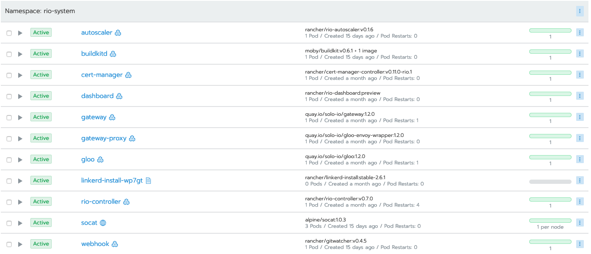

# Rio Demonstration

The following steps will walk you through demonstrating Rio on a Kubernetes cluster. 


## Pre-requisites

1. Have `rio` CLI installed. As of this writing, the latest version is v0.7.0
2. Have a 1.15+ Kubernetes cluster available on which to install Rio
   1. Have the appropriate network ports open to this cluster. If using a LoadBalancer, this is 80/443 (and 6443 for kube api comms). If using NodePorts, this will be whatever NodePort is allocated post-Rio installation. 
3. Have `kubectl` installed
4. Have [hey](https://github.com/rakyll/hey) installed (used for sending synthetic load)

## Rio Installation

### Environment Prep

* Ensure that you have your Kubernetes environment appropriately setup. That is, you have a properly-set `KUBECONFIG` env var that points to your Kubernetes cluster.
* Ensure that the `rio` executable is available. (`which rio`)

### Rio installation

Install rio by executing `rio install`. Optionally pass `--ip-address` argument if your worker nodes are using private or inaccessible IPs and you need to manually specify their public IP(s). 

Rio will inquire as to your preference for Let's Encrypt setup. Please select appropriately:

```
$ rio install
Please provide your Let's Encrypt email

[1]: Provide an Email address.
	This is used to send you important notifications and certificate expiration warnings.
	It will never be shared with Rancher.
[2]: Use Let's Encrypt with no email address.
	This is strongly discouraged and lack of notifications may cause you to lose access to your certificates.
[3]: Do not use Let's Encrypt at all.
	Cert-manager will not be deployed and no certificates will be automatically issued for you.
	You will not be able to use dashboard unless you configure custom cluster domain and wildcard certificates.
Select Number [] 1
```

Rio will then walk through installation steps. You can watch this occur on the command line, or in Rancher. In order to view the deployments in Rancher, you'll need to add the `linkerd` and `rio-system` namespaces to a project. Once you have done so:




You can also verify these exist by executing `kubectl get deploy -n rio-system`: 
```
$ kubectl get deploy -n rio-system
NAME             READY   UP-TO-DATE   AVAILABLE   AGE
cert-manager     1/1     1            1           4m15s
gateway          1/1     1            1           4m22s
gateway-proxy    1/1     1            1           4m22s
gloo             1/1     1            1           4m22s
rio-controller   1/1     1            1           4m35s
```

Rio deploys the [linkerd](https://linkerd.io) service mesh by default. 

At the end of installation, note how Rio has generated a cluster domain for you:

```
Generating clusterDomain for this cluster: j4j0tb.on-rio.io. Verified clusterDomain is reachable.
```

This is a wildcard domain used for sending workload traffic to Rio. 

## Rio Demonstration

At this point, you should have Rio installed into your Kubernetes cluster. 

To demonstrate along with the slide deck, do the following steps:

1. Execute `rio run -p 80:8080 --scale 1-10 https://github.com/ebauman/rio-demo-code`

    Speak to the following points:
    1. Rio run is how you start *Services*
    2. `-p 80:8080` functions the same as it does in `docker run`
    3. `--scale 1-10` enables autoscaling for this workload, min-max. 
    4. Passing a git repo instead of an image enables building the code

2. Execute `watch rio ps` to watch a build and deploy happening in real-time.

    Speak to the following points:
    1. Tekton pipelines (formerly knative build) is building the code in the background
    2. Once built, this code is published to an internal image repository
    3. That container image is then put into a Kubernetes Deployment

3. Once built, grab the generated endpoint (`rio ps`) and open the URL
