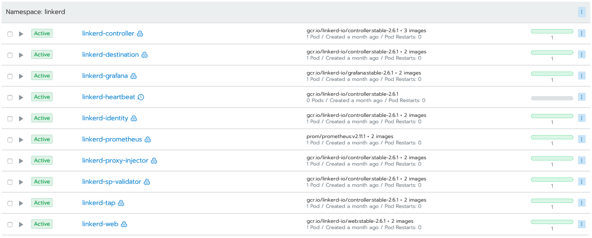

# Rio Demonstration

The following steps will walk you through demonstrating Rio on a Kubernetes cluster. 


## Pre-requisites

1. Have `rio` CLI installed. As of this writing, the latest version is v0.7.0
2. Have a 1.15+ Kubernetes cluster available on which to install Rio
   1. Have the appropriate network ports open to this cluster. If using a LoadBalancer, this is 80/443 (and 6443 for kube api comms). If using NodePorts, this will be whatever NodePort is allocated post-Rio installation. 
3. Have `kubectl` installed
4. Have [hey](https://github.com/rakyll/hey) installed (used for sending synthetic load)

## Rio Installation

### Environment Prep

* Ensure that you have your Kubernetes environment appropriately setup. That is, you have a properly-set `KUBECONFIG` env var that points to your Kubernetes cluster.
* Ensure that the `rio` executable is available. (`which rio`)

### Rio installation

Install rio by executing `rio install`. Optionally pass `--ip-address` argument if your worker nodes are using private or inaccessible IPs and you need to manually specify their public IP(s). 

Rio will inquire as to your preference for Let's Encrypt setup. Please select appropriately:

```
$ rio install
Please provide your Let's Encrypt email

[1]: Provide an Email address.
	This is used to send you important notifications and certificate expiration warnings.
	It will never be shared with Rancher.
[2]: Use Let's Encrypt with no email address.
	This is strongly discouraged and lack of notifications may cause you to lose access to your certificates.
[3]: Do not use Let's Encrypt at all.
	Cert-manager will not be deployed and no certificates will be automatically issued for you.
	You will not be able to use dashboard unless you configure custom cluster domain and wildcard certificates.
Select Number [] 1
```

Rio will then walk through installation steps. You can watch this occur on the command line, or in Rancher. In order to view the deployments in Rancher, you'll need to add the `linkerd` and `rio-system` namespaces to a project. Once you have done so:




You can also verify these exist by executing `kubectl get deploy -n rio-system`: 
```
$ kubectl get deploy -n rio-system
NAME             READY   UP-TO-DATE   AVAILABLE   AGE
cert-manager     1/1     1            1           4m15s
gateway          1/1     1            1           4m22s
gateway-proxy    1/1     1            1           4m22s
gloo             1/1     1            1           4m22s
rio-controller   1/1     1            1           4m35s
```

Rio deploys the [linkerd](https://linkerd.io) service mesh by default. 

At the end of installation, note how Rio has generated a cluster domain for you:

```
Generating clusterDomain for this cluster: j4j0tb.on-rio.io. Verified clusterDomain is reachable.
```

This is a wildcard domain used for sending workload traffic to Rio. 

## Rio Demonstration

At this point, you should have Rio installed into your Kubernetes cluster. 

To demonstrate along with the slide deck, do the following steps:

1. Execute `rio run -p 80:8080 --name rio-demo --scale 1-10 https://github.com/ebauman/rio-demo-code`

    Speak to the following points:
    1. Rio run is how you start *Services*
    2. `-p 80:8080` functions the same as it does in `docker run`
    3. `--scale 1-10` enables autoscaling for this workload, min-max. 
    4. Passing a git repo instead of an image enables building the code

2. Execute `watch rio ps` to watch a build and deploy happening in real-time.

    Speak to the following points:
    1. Tekton pipelines (formerly knative build) is building the code in the background
    2. Once built, this code is published to an internal image repository
    3. That container image is then put into a Kubernetes Deployment

3. Once built, grab the generated endpoint (`rio ps`) and open the URL
    
    Speak to the following points:
    1. Rio domain was auto-generated (`xxxx.on-rio.io`)
    2. This service has a service-specific domain (`rio-demo-v0.xxxx.on-rio.io`)
    3. Rio auto-secured using Let's Encrypt wildcard certificate (valid for `xxxx.on-rio.io`)

4. Demonstrate auto-scaling:
   1. Execute `rio inspect rio-demo` to grab the HTTP endpoint (*not* https) for the service.
   2. Execute `hey -c 60 -z 3m http://rio-demo-v0.xxxx.on-rio.io:12345` to send 60 concurrent requests for 3 minutes to the service
   3. Execute `watch rio ps` and observe the Rio service auto-scale after a period of time, up to 10 replicas.
   4. Stop `hey` (ctrl-c) and observe after a period of time, the scale falls back to 1

    Speak to the following points:
    1. `hey` is only capable of handling `http` traffic, so we needed to find that endpoint. There is more info available using `rio inspect` (out of scope of this demo)
    2. Rio is capable of scaling to 0
    3. Scaling is performed based on QPS, which is subject to the perf characteristics of the app being scaled. (e.g. if app responds quickly, QPS may not reach 60)
    4. QPS is based on metrics exported from linkerd sidecar. Autoscaling is done via lightweight autoscaler that is part of Rio.

5. Demonstrate staging:
   1. Execute `rio stage --image ebauman/rio-demo:v2 rio-demo v2`
        
        We are staging a new version of a service, and giving it v2 as the version tag. 

   2. Execute `rio ps` and note that there is a new version staged.

   3. Execute `rio endpoints` and note the single endpoint that is pointing to `v0` of the application

        This is a good place to talk about how *Apps* differ from *Services*. Explain how Apps are collections of Services, and traffic is distributed according to the Weight column available when executing `rio ps`
   4. Open the App endpoint in the browser. Note how this is currently showing the output of app version v0.  
   5. Execute `rio promote rio-demo@v2` and note how traffic shifts (`rio ps`)

        After `rio promote` has been executed, you can follow it up with `rio ps`. This will show the Weight column as having shifted traffic 100% to your new v2 service.
   6. Refresh the App endpoint you opened in step #4, and how the output is now showing v2. 

6. Demonstrate routing
   1. Execute `rio route add rio-demo/old to rio-demo@v0`
   2. Execute `rio route list` to show the list of routes. Demonstrate opening the /old URL and how traffic is diverted to the old deployment. 


## Other Topics

### Rio Dashboard

To launch (and enable the feature if disabled) execute `rio dashboard`. 

The dashboard is in active development, and undergoing quite a bit of refinement. Some features are not yet 100% implemented, so use with caution. 

### Linkerd

Linkerd has a dashboard that can be viewed. To open, execute `rio linkerd`. 
This will proxy the dashboard to your local workstatin, and open `127.0.0.1:9999` for viewing.

### External Services

Rio has the capability to register external services into the Linkerd service mesh.

To configure, execute `rio externalservice`.